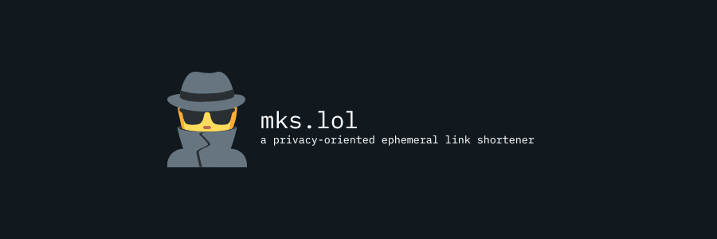

---

Are you worried about malicious actors getting access to your chat longs and accessing private URLs that you've shared with friends and family?
Periodically deleting or encrypting these logs can guarantee that these urls won't be leaked, but in some cases you don't have this option.

By temporarily storing an url to another address, `mks.lol` guarantees that someone with access to your chat logs will not be able to access private information.

## Features

- Zero client-side javascript.
- Zero logging.
- Only depends on Go's standard library (excluding [styling with picocss](https://picocss.com)).
- In-memory storage only.
- Self-contained binary.

## Usage

There is a public instance running at [https://mks.lol/](https://mks.lol/), and pre-build binaries in the releases page.

### Building from source

```shell
$ git clone https://github.com/guilherme-puida/mks.lol.git
$ cd mks.lol
```

Now, if you have [just](https://github.com/casey/just) installed, just run `just build-server`.
See the justfile for more information about building manually (just run the commands in `build-server`).

### Running

The service is configured via Environment Variables.
There is a sample [.env file](./.env) pre-configured to run mks.lol locally.
When running via `just run-server`, the variables defined there are automatically exported to the environment.